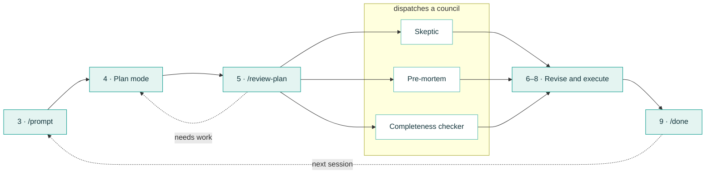

# Occasional Users

You've run one session. This is the loop for work where being wrong would cost you something — a
proposal, a memo, a research design, anything you'd be embarrassed to send out unchecked.

The move it adds is small and it is the whole point: **you read a plan before any work happens, and
so do three critics who are trying to find what's wrong with it.**

<!-- EDITORIAL: this link points at essentials/project-folders.md, which mostly teaches browser
     Projects. The sentence here is about a task having a local folder of its own. If a dedicated
     local-folder guide lands (see BACKLOG C2/N7), repoint it. -->
Optional first: if you haven't settled how you keep project files, I write about my [AI project
folder system](../essentials/project-folders.md) here, and it's worth a ten-minute read. Nothing
below depends on it, but the loop is easier when a task has a folder of its own.

**What you'll use.**

| Command | What it does |
|---|---|
| `/prompt` | Turns a rough or dictated request into a sharper one. Optional — plain English works |
| `/review-plan` | Sends a plan to a panel of critics, using the `/council` command, and comes back with their objections — plus a suggested revised plan when it thinks revision is needed. It changes nothing until you accept |
| `/council` | The panel itself. `/review-plan` calls it for you, but you can also point it straight at finished work |
| `/done` | Writes the handoff note at the end of a session |

<div class="checklist" markdown>

## Set up once

### 1. Install the skills

These are skills I've written and packaged. They're not built into either app, so you add them
once and they're there from then on.

=== "Claude"

    No terminal needed.

    1. Open **Customize → Plugins**. The easiest way to find this is the search box in the
       top-left corner of the window — search **"Customize plugins"**.
    2. Under **Personal plugins**, click **"+" → Add marketplace**, and enter
       `chrisblattman/claudeblattman` straight into the box.
    3. Click **Browse plugins**, find **starter-kit**, and **Install**.
    4. Start a new session — **Cmd-N** on a Mac, **Ctrl-N** on Windows — and type `/kit-hello`.
       If it answers, you're set.

=== "Codex"

    Codex has no in-app installer, so this one runs a short script. You do it once.

    1. Download the [`codex-starter` folder](https://github.com/chrisblattman/claudeblattman/tree/main/codex-starter)
       from the repository.
    2. From inside that folder, run `python3 install-codex-starter.py install`. This is the one
       terminal command on this page, and nothing after it needs one.
    3. Restart Codex so it picks up the new skills.
    4. In a new Codex session, type `$prompt`. If it answers, you're set.

!!! warning "What the starter kit does and doesn't give you"
    The Claude kit is six skills — `kit-hello`, `kit-setup`, `prompt`, `review-plan`, `council`,
    `done` — not everything on this site. Deep research and the project workflows are separate and
    are **not** in this bundle.

    And the commands are shortcuts, not the method. If you'd rather install nothing, every step
    below works in plain language — describe what you want instead of typing a command.

<!-- EDITORIAL — unverified against the live apps, see BACKLOG B3/B7:
     · the "Customize plugins" search label and that it reaches Customize → Plugins
     · that the repository id can be pasted straight into Add marketplace, with no
       "Add from a repository" sub-step
     · Cmd-N / Ctrl-N as the new-session shortcut in the Claude desktop app
     All three are Shay's own observations from the real app. Confirm before this is published.

     EDITORIAL — the Codex tab documents the real codex-starter/install-codex-starter.py route,
     which needs a terminal. BACKLOG N9 tracks making Codex installable without one; when that
     lands, rewrite this tab and drop the "one terminal command" line. -->


<label class="step-done"><input type="checkbox"> I've installed the starter kit, or I've decided to run this in plain language instead.</label>

## Plan it, then challenge it

### 2. Pick one bounded task

Something real, with an end: a two-page memo, a grant section, a reviewer response, a dataset
cleaning pass. Not "sort out the project."

Put the relevant files in a folder and point the agent at it, the way you did in your first
session.

<label class="step-done"><input type="checkbox"> I've chosen one bounded task and the agent can see the relevant files.</label>

### 3. Say what a good result looks like

This is the step that does the most work, and it's the one people skip. Say it in ordinary prose,
or dictate it — four things:

- **The goal.** What should exist at the end.
- **Who it's for.** A funder reads differently from a co-author.
- **The constraints.** Length, format, deadline, what must not change.
- **What good looks like.** How you'll know it worked.

That last one matters more than it sounds. "A good version is one my co-author can send without
rewriting the methods section" gives the critics in step 5 something to test against.

!!! tip "If it comes out as a ramble"
    Type `/prompt` at the start of your message before sending it. It turns a rough description
    into a sharper request and shows you what it changed. Skip it if your description is already clear — it's a tidy-up, not a
    requirement.

<label class="step-done"><input type="checkbox"> I've described the goal, the audience, the constraints, and what a good result looks like.</label>

### 4. Ask for a plan, not an answer

Ask it to read the material first and come back with an approach:

```
Read these files first. Then give me a short plan for how you'd do this — the steps, in order, and how we'll know each one worked.
```

A plan you can read in a minute is worth more than a draft you have to unpick. You are about to
hand it to critics, so you can catch the gaps before the agent spends time and tokens doing the
work.

<label class="step-done"><input type="checkbox"> I have a written plan with steps and success checks.</label>

### 5. Send the plan to a council

Type:

```
/review-plan
```

For a plan of any substance this runs a **council** by default. Here is what that actually means,
because the word suggests more than it does.

An **agent** is the thing you've been talking to. It can start helpers — **subagents** — that work
on one narrow job and report back. A council is three or more of those helpers, each given a
different brief. **This starter kit sends three by default** — the panel below — and caps a
council at four:

| Critic | What it's looking for |
|---|---|
| **Skeptic** | Which load-bearing claims aren't actually backed by anything |
| **Pre-mortem** | Assumes it already failed, and works backwards to the top three reasons |
| **Completeness checker** | What a domain expert would expect to see that isn't there |

They run **in parallel, each in its own context**, so none of them sees what the others wrote and
none can be talked round by the first confident opinion in the room. That is the useful property,
and it is worth being precise about it: they are separate conversations, not separate minds. All
three are the same underlying model reading the same plan, so they share its blind spots. What you
get is three different *angles*, not three independent experts.

A fourth step then reads all three critiques together and reconciles them into one verdict with a
revised plan. That synthesis is automatic — there's no command for it, and you'll just see the
result.

For something small — a quick lookup, a one-file edit, a to-do list — type `/review-plan quick`
instead and you get a single fast review. The council is for plans where a missed flaw would cost
real time or credibility.

!!! tip "Here's where it gets fun — pick your own critics"
    If you're working on something niche, you don't have to accept the default three. Ask for the
    line-up you actually want:

    ```
    /review-plan --panel skeptic,pre-mortem,chief-of-staff
    ```

    The kit ships a fourth critic, **chief-of-staff**, who asks what saying yes to this plan costs
    you — useful when the plan is really a decision in disguise. Name a role the kit doesn't have
    and it will tell you the persona is missing rather than quietly inventing one, which is the
    behaviour you want: a critic with no brief is just an echo.

<!-- EDITORIAL: Shay asked for a link here to how you add your own critic roles. Left out on
     purpose. The obvious destination, workflows/council.md, still describes the older five-critic
     setup with --chef-skill and personas (editor, referee, methodologist) that the shipped kit
     does NOT contain — linking it would contradict the cap-of-four line three paragraphs up.
     BACKLOG C9 tracks the rewrite; add the link when that page matches the bundle. -->

<label class="step-done"><input type="checkbox"> I've run the plan past the critics and read what came back.</label>

### 6. Settle the plan

Read the objections before the suggested revised plan. The objections are the product; the
revision is one way of resolving them, offered for you to judge — nothing is applied until you
say so.

Three things to do with them:

- **Accept the ones that are right.** Most will be.
- **Overrule the ones that aren't** — out loud, in the chat. *"Ignore the point about sample size,
  that's fixed by the pre-registration."* Say why, so it doesn't come back.
- **Resolve real disagreements yourself.** When two critics want opposite things, that's usually a
  decision only you can make, and it's exactly the thing you wanted surfaced before the work
  started rather than after.

Then approve the plan you actually want.

!!! tip "Want a second opinion from a different AI?"
    1. The most useful cross-check is **another AI** — Codex if you're in Claude, Claude if you're
       in Codex. Different training, different blind spots.
    2. The easy route is to copy the plan into the other app and ask: *"Critique this plan as a
       skeptic."*
    3. There's also an automated route that sends the plan, collects the other AI's critique and
       folds it back in without leaving the app –– read
       [how to set that up here](../system/ai-integration.md).

    Either route sends your whole plan to another company's service. Don't use it with
    confidential, participant, or unpublished material.

<!-- EDITORIAL: the "how to set that up" link goes to system/ai-integration.md, which today only
     covers Claude → peer and still describes `--mixed` rather than the shipped `--peer`. The
     Codex → Claude direction is undocumented. BACKLOG C10. -->


<label class="step-done"><input type="checkbox"> I've resolved the objections and approved a plan I actually agree with.</label>

## Do it and check

### 7. Let it execute

Approve it and let it work through the plan. It'll pause for permission on changes; approve the
ones you understand, and ask what something is for when you don't.

<label class="step-done"><input type="checkbox"> The agent has worked through the plan and stopped.</label>

### 8. Check the output against its own promises

Open what it made and read it. Then go back to the success checks from step 3 and test them one at
a time — the plan promised specific things, so check those specific things.

Three failures worth looking for by name, because they're the common ones:

- **A citation or a number that doesn't trace.** Follow one or two back to the source.
- **A section that is fluent and empty.** Reads well, says nothing, usually where it knew least.
- **Something quietly dropped.** Compare against the plan, not against your memory of the plan.

If something failed, say so plainly and ask for a fix. You don't need a new plan for a small
correction.

!!! tip "For something consequential, review the output too"
    The same critics can read a finished piece of work, not just a plan. Point it to the output
    file and ask for a critique against the original brief — pointing beats pasting, because the
    critics then read the real thing rather than your copy of it.

    ```
    /council file:<the output file> — critique this against the plan we agreed and the decisions we made along the way. Where it falls short, say which part and why.
    ```

    Worth it for anything going to a funder, a journal, or a public audience — and **especially
    useful for code the AI wrote**, where a confident-looking script can be quietly wrong in a way
    prose rarely is. Skip it for the small stuff. The fuller version is on the
    [Regular Users](regular.md) page.

<label class="step-done"><input type="checkbox"> I've opened the output and tested it against the success checks I set in step 3.</label>

### 9. Save a continuation note

If the task continues, type:

```
/done
```

It writes the `HANDOFF.md` note — what happened, what was decided, what's next. Next time you
open the folder, ask it to read that note first and you start where you stopped instead of
re-explaining.

<label class="step-done"><input type="checkbox"> The work is saved, and there's a note for whoever picks this up next, including me.</label>
</div>

## Recap: the loop you just ran

Steps 1 and 2 were setup. This is everything from step 3 on — the part that makes this different
from asking a chatbot.



## What to try next

- **[Regular Users](regular.md)** — running an ongoing project across many sessions, rather than
  one task at a time.
- **[Deep research](../workflows/deep-research.md)** — for when the gap is a literature rather
  than a task: run the same question past several AIs in parallel and get a synthesis that names
  where they disagreed. A separate workflow with its own setup, not one of the six skills above.
- **[Councils in depth](../workflows/council.md)** — panels beyond the default three, and when a
  different line-up is worth it.
